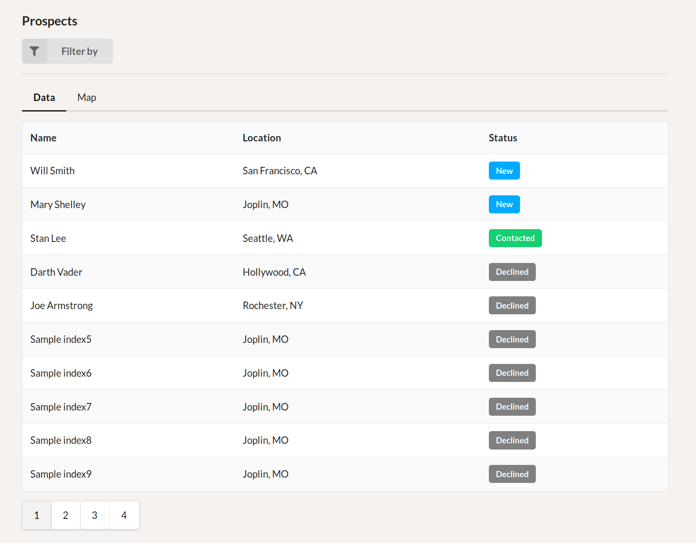
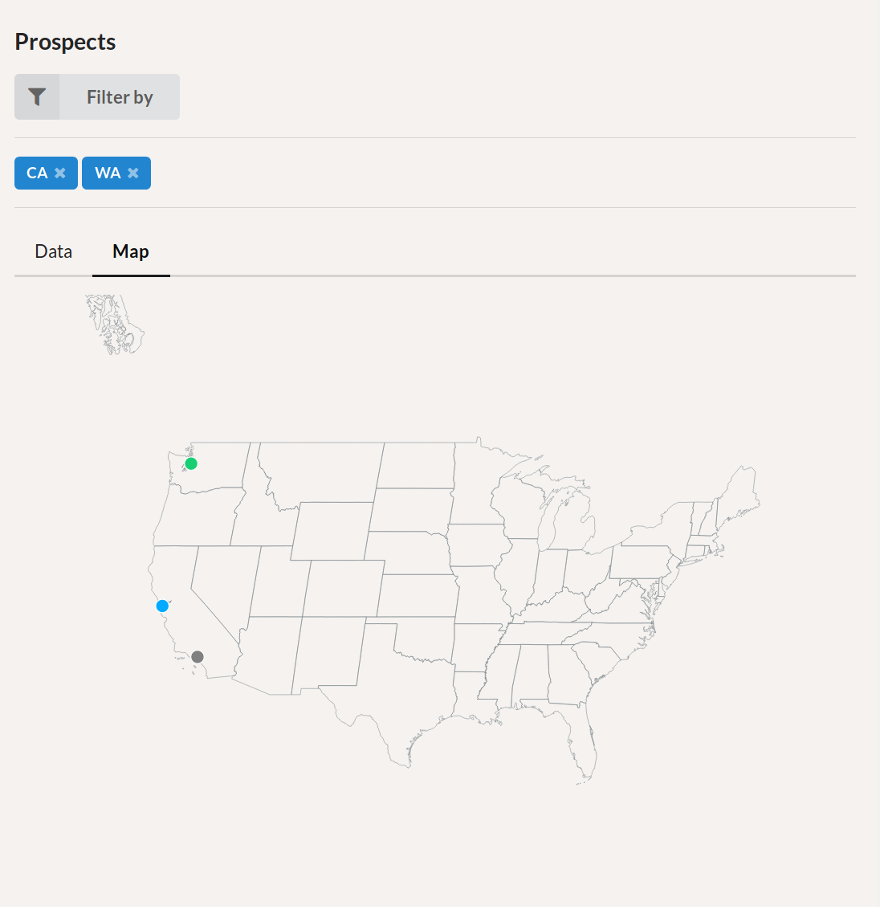
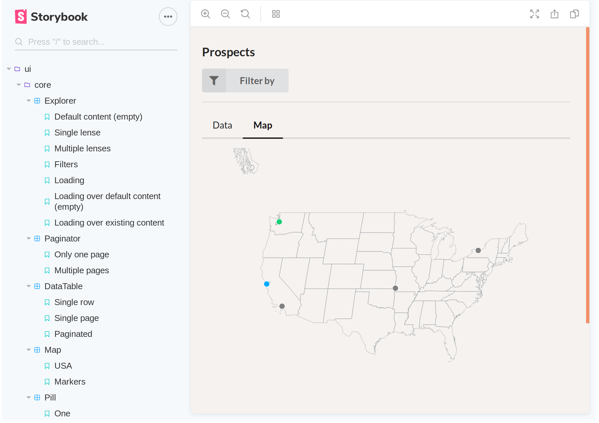
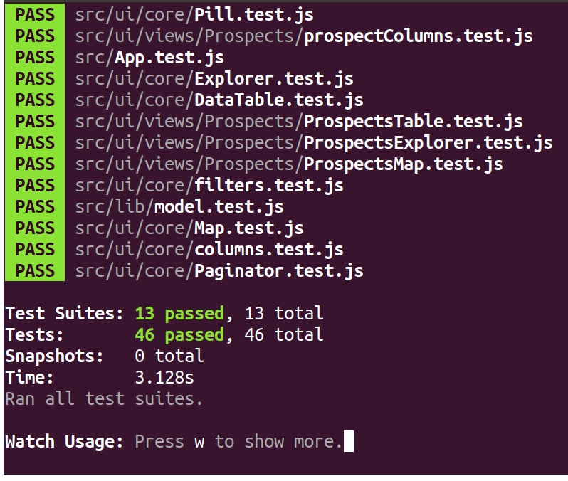
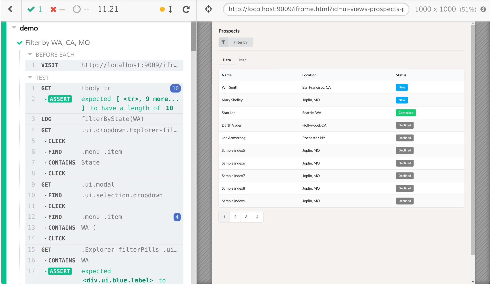

# Prospects App

This app consists of two views of prospects:

- Data view -- A simple paginated table of prospects with colored funnel status column
- Map view -- Shows prospects on a US map, colored by funnel status

Extra:

- Filter by prospect's state: CA, MO, NY, WA

#### Data view


#### Map view


# Essential commands

#### Install

```bash
$ git clone https://github.com/keeyip/starter.git
$ cd starter
$ yarn
```

#### Start the app

```bash
yarn start
```

#### Start Storybook

```bash
$ yarn run storybook
```

#### Run Jest unit tests

```bash
$ yarn test --watchAll
```

#### Start Cypress end-to-end tests

**NOTE:** Storybook must be running.

```bash
$ yarn run cypress open
```

# Methodology

Drawing from experience, data table UI implementations easily become unwieldy unless significant care has been taken at the onset to create a simple code architecture.

I decided to start with a generic domain-agnostic core and work my way up to a domain-specific use case: in other words, I created a few generic data table-related components, then I built the prospects-specific version by re-using and specializing a generic data table to fit that use case---including a color-coded status column, for example.

Filtering is not stuffed into the data table implementation. Instead I extracted a higher-level component, called Explorer, that houses the title, "Filter by" dropdown, and multiple "lenses" that are individually responsible for presenting a specific view of the data.

The Explorer is agnostic of what the data is and where it came from, it is simply responsible for facilitating filter addition, listing, and removal as well as switching to different lenses. The lenses themselves are responsible for rendering a concrete representation of the data.

I've also taken care to make every single UI component a simple function, with local state handled via React Hooks. And as much as possible, I lifted state up to avoid pushing complex use case-specific code into generic components. In general, I follow a functional, composable approach to the UI implementation.

Here is a high-level pseudo-code summary of the component hierarchy:

```js
/** Generic components **/

function Explorer({filterOptions, lenses}) {
  return render(
    Dropdown(options=filterOptions),
    TabMenu(items=lenses)
  )
}

const NameColumn = {
  label: 'Name',
  renderItem: item => item.name
}

const LocationColumn = {
  label: 'Location',
  renderItem: item => `${item.location.city}, ${item.location.state}`
}

function DataTable({columns, data, paginationSettings}) {
  return render(
    NativeTable({columns, data}),
    Paginator({paginationSettings})
  )
}

function Map({markers}) {
  return render(
    SVG(markers)
  )
}


/** Domain-specific components **/

function ProspectsExplorer({prospects}) {
  const lenses = [
    ProspectsDataTable({prospects}),
    ProspectsMap({prospects})
  ]
  
  return Explorer({filterOptions=..., lenses})
}

const ProspectStatusColumn = {
  label: 'Status',
  renderItem: prospect => NativeLabel({color: colorForStatus(prospect.status), text: prospect.status)
}

function ProspectsDataTable({prospects) {
  const columns = [NameColumn, LocationColumn, ProspectStatusColumn];
  return DataTable({items: prospects, columns})
}

function ProspectsMap({prospects}) {
  return Map({markers: prospects.map(p => {color: colorForStatus(prospect.status), coordinates: prospect.location.coordinates})})
}
```

Here is what we gain by implementing the UI components in this way:

- Domain-specific components are simply specializations built by composing generic components, keeping the whole system easier to reason about
- Generic components are simpler and use-case agnostic, which also simplifies and speeds up unit and integration tests
- It is easier to re-purpose generic components because they are designed from the onset to be composable and customized via configuration rather than extension

# File structure

NOTE: Some trivial files omitted.

```
src
├── lib # Put all non-UI application code in here
│   ├── __mocks__
│   │   └── queries.js # Contains a mocked version of the real queries.js
│   │
│   ├── model.js # Contains all business constants and logic; no ajax, no UI code
│   └── queries.js # Contains all ajax code
│
└── ui
    ├── core # Put all generic UI components in here
    │   ├── columns.js # Holds all generic table columns
    │   ├── DataTable.js # A generic data table implementation
    │   ├── Explorer.js # A generic "explorer"
    │   ├── filters.js # Holds all generic filter controls
    │   ├── Map.js # A generialized svg map that can show colored markers
    │   ├── Paginator.js # A simple pagination control
    │   ├── Pill.js # A colored label that can show a delete button
    │
    └── views # Put all domain-specific UI components in here
        └── Prospects # Put all prospects-related UI components here
            ├── prospectColumns.js
            ├── ProspectsExplorer.js
            ├── ProspectsMap.js
            ├── ProspectsPage.js
            ├── ProspectsTable.js

├── semantic-ui # I use semantic-ui for a simple, functional foundation
│   ├── site
│   │   ├── globals
│   │   │   ├── site.overrides
│   │   │   └── site.variables
│   │   │
│   │   └── modules
│   │       ├── dimmer.overrides
│   │       └── dimmer.variables
│   │
│   └── theme.config
│
├── stories # I use storybook for visual testing and quick scenario-based development
│   ├── coreColumnsStory.js
│   ├── coreFiltersStory.js
│   ├── DataTableStory.js
│   ├── ExplorerStory.js
│   ├── index.js
│   ├── MapStory.js
│   ├── PaginatorStory.js
│   ├── PillStory.js
│   ├── prospectColumnsStory.js
│   ├── ProspectsExplorerStory.js
│   ├── ProspectsMapStory.js
│   ├── ProspectsPageStory.js
│   ├── ProspectsTableStory.js
│   └── storyUtil.js
│
├── samples # Simple hand-made test data
│   ├── geo.js
│   └── prospects.js
│
cypress # I use cypress for fast end-to-end automated testing
├── integration
│   └── ProspectsPage
│       └── demo.spec.js
```

# Testing

#### Storybook for manual visual testing
Storybook is great for jumping into specific scenarios. I've created "stories" for every single UI component, which enables me to very easily make sanity checks or to work on a specific problem in isolation.



#### Jest for unit tests
Non-UI code such as the modules in `src/lib/` are easily unit-tested.

UI components are also unit tested, but only for DOM-hierarchy correctness, not interaction.



#### Cypress for end-to-end tests
Complex UI interaction is best covered by end-to-end tests  that exercise the system as a whole. I chose Cypress for its terrific API and speed.

**Note:** normally the app would show a faint loading screen and be subject to simulated network lag, but for automated tests I removed these two factors by configuring Storybook to use `src/lib/__mocks__/queries.js`; this is why I point Cypress at Storybook instead of the verbatim app.


